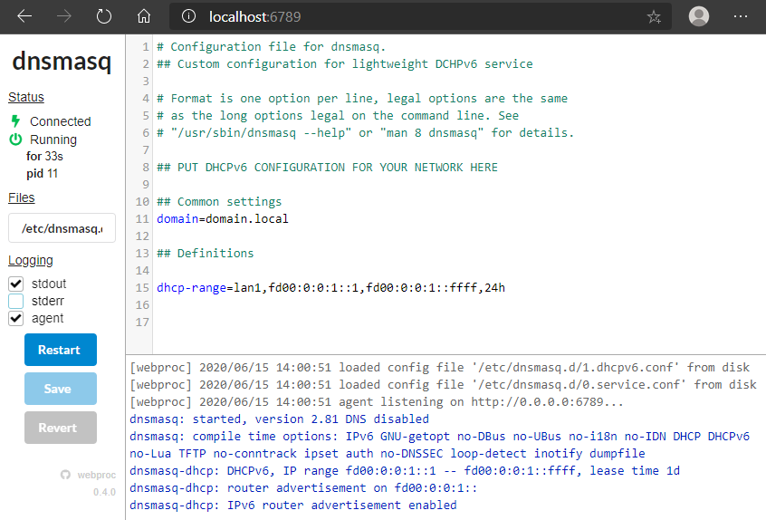

# Lightweight DCHPv6 service

A [**dnsmasq**](http://www.thekelleys.org.uk/dnsmasq/doc.html) docker image pre-configured for a lightweight DHCPv6 service usage. Using [**webproc**](https://github.com/jpillora/webproc/) as light WebUI.

[](https://hub.docker.com/repository/docker/styx0x6/dhcpv6)
[](https://hub.docker.com/repository/docker/styx0x6/dhcpv6)
[](https://travis-ci.org/styx0x6/dhcpv6)
[](https://raw.githubusercontent.com/styx0x6/dhcpv6/master/LICENSE)

## About

It started with a statement, a lack of features with internet home magic boxes. A lot of providers are offering IPv6. A good thing. But it's only designed to work for websurfing, with a classical SLAAC autoconfiguration into subnet announced by RA, sometimes with the possibility to customize RDNSS options with your own-selected DNS instead of ISP provided ones. Also, and unfortunately eachtime, there is no way to set static IPv6 definitions in a centralized way (aka DHCPv6).

A very useful feature when you're using a local DNS for your local network's devices :). That's why, with this (packaged) DHCPv6 service you should be able to overcome this lack of feature. Just drop it in your network, and that's it.

Another important point: with DHCPv6, you are mastering your IPv6 assignation policy. As you should know, SLAAC is suffering of some well-known flaws regarding IPv6 autoconfiguration. Some of devices are still generating theirs own IPv6 addresses using the deprecated RFC 8064, RFC 4862 (aka autoconfiguration based on MAC address (EUI-64)), and this is a kind of privacy issue we don't really like when going on internet!

### Usage scenario

As said, this image is useful for home networks.

Your ISP home box-modem-router-whatyouwant is only giving you DHCPv4 service and you want DHCPv6 service for the reasons spelt out above, in order to be a good nerd using a full dual stack IPv4/IPv6 network at home. Let your magic router manage DHCPv4, it's an out of the box service (no need to be touched -> [KISS](https://en.wikipedia.org/wiki/KISS_principle) principle \o/), and deploy this docker image on your NAS, Raspberry Pi, or home-hosted server to get DHCPv6. Why don't use dnsmasq features to totally manage DHCPv4 **AND** DHCPv6? You can. But in my opinion, it's no more KISS. Why? Imagine that your docker hosting server is down, then no more IPv4 is served to your devices, and you feel annoyed to no more access the internet. So let the router manage IPv4, and deploy this docker image for DHCPv6. At least without DHCPv6, SLAAC remains.

Obviously, this docker image can be set up as you want in order to follow your needs: it's only **dnsmasq**.

## Run

1. Get the image:

    ```cmd
    docker pull styx0x6/dhcpv6
    ```

2. Run a container:

    ```cmd
    docker run --name dhcpv6 -d --restart always --cap-add=NET_ADMIN -p 6789:6789/tcp -p 547:547/udp -v <VOLUME_DNSMASQ>/log/dnsmasq.log:/var/log/dnsmasq.log -v <VOLUME_DNSMASQ>/dnsmasq.d/:/etc/dnsmasq.d/ [-e "WP_MAX_LINES=<WP_MAX_LINES>"] [-e "DNSMASQ_LOG=<DNSMASQ_LOG>"] [-e "HTTP_USER=<HTTP_USER>"] [-e "HTTP_PASS=<HTTP_PASS>"] styx0x6/dhcpv6
    ```

    **where:**
    * `<VOLUME_DNSMASQ>`, the set volume for your container into your running environment.

    *optional:*
    * `<WP_MAX_LINES>`, the maximum number of log lines to show in WebUI. Default is 5000.
    * `<DNSMASQ_LOG>`, the dnsmasq log facility. `log-facility=` directive in dnsmasq.conf. Default is `/var/log/dnsmasq.log`. To send logging to stdout you can set it to `-` .i.e. `-e "DNSMASQ_LOG=-"`.

    *optional, only if you want to use basic authentication for webproc (these env var are directly used by webproc):*
    * `<HTTP_USER>`, username.
    * `<HTTP_PASS>`, password. Take care, it's a basic feature, your password will not be stored securely.

3. Manage it via `http://<docker_host>:6789`:



## Build

* Get the code:

    ```cmd
    git clone https://github.com/styx0x6/dhcpv6
    ```

* Build your own docker image:

    ```cmd
    docker build -t dhcpv6 .
    ```

## Configuration files

### dnsmasq configuration files

Static files that should not be modified:

* `/etc/default/dnsmasq` used to launch the dnsmasq service.
* `/etc/dnsmasq.conf` the default dnsmasq configuration file, only used to load `*.conf` files under `/etc/dnsmasq.d/`.
* `/etc/dnsmasq.d/0.service.conf` used to configure the DHCPv6 service.

User configuration files:

* `/etc/dnsmasq.d/1.dhcpv6.conf` used to define the DHCPv6 configuration for your networks. You can find [here](doc/dhcpv6.doc.conf) filtered-out options to set in this file or the full official [dnsmasq.conf](http://thekelleys.org.uk/gitweb/?p=dnsmasq.git;a=blob_plain;f=dnsmasq.conf.example;hb=HEAD) example.

As this Docker image is nothing else than a dnsmasq packaging, it works obviously also with IPv4 definitions.

**dnsmasq** official [documentation](http://www.thekelleys.org.uk/dnsmasq/doc.html)

***Helpful resources:***

* [DHCPv6 and RA with dnsmasq](https://weirdfellow.wordpress.com/2014/09/05/dhcpv6-and-ra-with-dnsmasq/)
* [DHCPv6](https://thirdinternet.com/dhcpv6/)

## Links

* Homepage: [https://github.com/styx0x6/dhcpv6](https://github.com/styx0x6/dhcpv6)
* Docker Hub: [https://hub.docker.com/styx0x6/dhcpv6](https://hub.docker.com/styx0x6/dhcpv6)
* Get docker image: `docker pull styx0x6/dhcpv6`
* Git repository: [git://github.com/styx0x6/dhcpv6.git](git://github.com/styx0x6/dhcpv6.git)
* Issues tracker: [https://github.com/styx0x6/dhcpv6/issues](https://github.com/styx0x6/dhcpv6/issues)

## Changelog

All details are here: [[CHANGELOG](CHANGELOG.md)]

## Contributing

Feel free to submit *issues* and enhancement via *pull requests*!

[[Bugs & Support](https://github.com/styx0x6/dhcpv6/issues)]  
[[How to contribute to a project on Github](https://gist.github.com/MarcDiethelm/7303312)] by Marc Diethelm.

## Third-Party Tools

This docker image is based on Jaime Pillora's work:

[https://github.com/jpillora/docker-dnsmasq](https://github.com/jpillora/docker-dnsmasq)
[https://hub.docker.com/r/jpillora/dnsmasq](https://hub.docker.com/r/jpillora/dnsmasq)

This Docker image includes bundled packages and below are their associated licensing terms:

* **Alpine Linux**

    Copyright (C) 2020, Alpine Linux Development Team. All rights reserved.

    [https://alpinelinux.org/](https://alpinelinux.org/)
    [https://hub.docker.com/_/alpine/](https://hub.docker.com/_/alpine/)

* **dnsmasq** [](http://thekelleys.org.uk/gitweb/?p=dnsmasq.git;a=blob_plain;f=COPYING-v3;hb=HEAD)

    Copyright (C) 2020, thekelleys.org.uk, Simon Kelley & Contributors.

    [http://www.thekelleys.org.uk/dnsmasq/doc.html](http://www.thekelleys.org.uk/dnsmasq/doc.html)

* **webproc** [](https://opensource.org/licenses/MIT)

    Copyright (C) 2017, Jaime Pillora <dev@jpillora.com>.

    [https://github.com/jpillora/webproc](https://github.com/jpillora/webproc)

Other used stuff:

* **Shields.io** - Badges as a service [](https://raw.githubusercontent.com/badges/shields/master/LICENSE)

    [http://shields.io/](http://shields.io/)  
    [https://github.com/badges/shields/](https://github.com/badges/shields/)

* **Simple Icons** - Icons as a service [](https://raw.githubusercontent.com/simple-icons/simple-icons/master/LICENSE.md)

    [https://simpleicons.org/](https://simpleicons.org/)  
    [https://github.com/simple-icons/simple-icons/](https://github.com/simple-icons/simple-icons/)
